# 캐치캐치 : 시즌아레나


**SSAFY 11기 2학기 특화 프로젝트**

도메인: 빅데이터 추천

기간: 2024.08.19 ~ 2024.10.11

|  팀원  |       역할       |
| :----: | :--------------: |
| 노영호 |  팀장, 게임, FE  |
| 고승희 |        FE        |
| 김도이 |        FE        |
| 윤여준 |   BE, AI, 게임   |
| 임종혁 | Infra(CI/CD), BE |
| 홍경현 |    BE, 디자인    |

## 프로젝트 배경 및 목적

아이들이 사계절의 아름다움과 계절감을 느끼며 야외활동을 즐길 수 있도록 돕기위해 ‘캐치캐치 : 시즌아레나’를 기획했습니다.

보건복지부 아동종합실태조사(2023)에 따르면, 지난 5년 아동의 과체중, 비만율이 약 3.5배 증가하였습니다. 이러한 배경에는 스마트폰 이용률의 증가가 있다는 연구결과가 있었습니다. 실제로 방송통신위원회 연도별 스마트폰 이용 추이에 따르면 스마트폰 이용률이 93.4%에 달하고 있습니다.

이를 역으로 이용해 모바일 디바이스를 활용하면서도 야외활동을 통해 계절을 학습하고 생태감수성을 기를 수 있는 서비스를 기획했습니다.

## 기술스택

### FE

React, Redux, TypeScript, JavaScript, PWA, ReactQuery, Tailwind

### BE

Java, SpringBoot, Spring Data JPA, Spring Security, Oauth2.0, Yolo v8 nano, Python, Fast API, Pytorch

### GAME

Javascript, Node.js, Socket.io, Express.js, Phaser.js

### DB

MySQL, Elasticsearch, Redis

### INFRA

AWS EC2, Docker, Jenkins, NginX, Ubuntu, Kafka, Docker compose, Jenkins, Monitoring ELK(Elasticsearch, Logstash, Kibana), Prometheus

## 기술 특징

### FrontEnd (FE)

- **상태 관리 라이브러리 활용:** 게임 아이템, 매칭, 결과 반영을 위한 상태 관리 라이브러리를 사용하여 서버 요청 없이 클라이언트 데이터의 정합성을 보장.
- **FSD 설계**: FSD설계에 Atomic 디자인 전략 일부를 적용하여 컴포넌트 재사용성을 극대화하고 비즈니스 지향적으로 설계. 기능 분할 설계로 결합도를 낮추고 응집력을 높임. 레이어를 통해 상속, 추상화와 다형성을, 공개 API를 통해 캡슐화 달성. 
- **Redux 활용**: 수집, 합성, 유저 정보, 게임, 인벤토리 등 다양한 기능에서 상태 관리를 위해 Redux 라이브러리를 적극 활용.
- **디자인 토큰과 함께 아토믹 디자인 패턴 방식을 일부 도입**: 일관성 있는 디자인 시스템 구축, 재사용성과 확장성 향상

### BackEnd (BE)

- **YOLO v8 모델 활용**: 자연물 데이터를 증강 학습시켜 실시간 자연물 객체 탐지 모델을 구축.
- **ELK 기반 빅데이터 활용 파이프라인 구축**: 수집된 게임 빅데이터를 통해 매칭 예상 소요시간을 반환하는 알고리즘 파이프라인 개발.
- **Spring Cloud** 를 통한 API 게이트웨이 도입 및 인증 인가 방식 처리

### Game

- **Socket.io를 통한 멀티 플레이 서버 구축**: 대규모 실시간 멀티 플레이 게임 서버를 구축하여 원활한 게임 환경 제공.
- **Socket.io를 통한 주기 정렬 매칭**: 주기적으로 레이팅 범위에 맞는 플레이어를 매칭 시켜 게임 방 생성. 대기 시간에 따른 동적 레이팅 범위 확장. redis에 플레이어 및 게임 방에 대한 정보를 저장하여 게임 서버와 연결.
- **Phaser.js를 통한 게임 화면 만들기**: Phaser.js를 이용하여 게임화면을 구성하여 다양한 애니메이션과 효과가 있는 게임 클라이언트 구현.

### Infra

- **elk**를 통한 로그 수집
- **blue green** 무증단 배포처리
- **jenkins** 및 **docker** 를 이용한 배포 자동화

## 프로젝트 개요

### 프로젝트 소개

**자연물 아이템 수집 및 배틀로얄 게임 캐치캐치 : 시즌아레나**

- 객체 탐지를 통한 사계절에 따른 제철 특산물 및 자연물 수집
  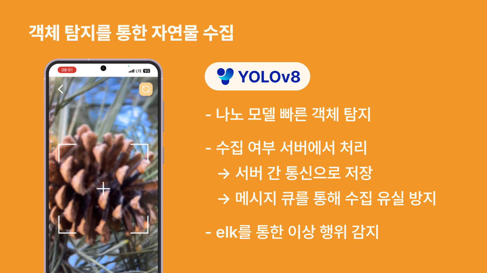

- 수집한 자연물의 시즌도감
  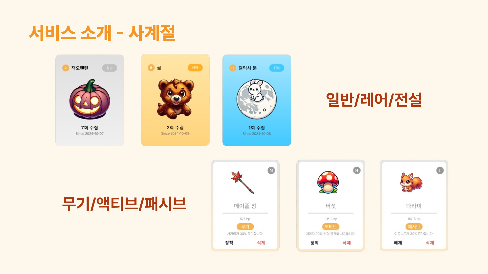

- 자연물 아이템으로 즐기는 배틀로얄 아레나
  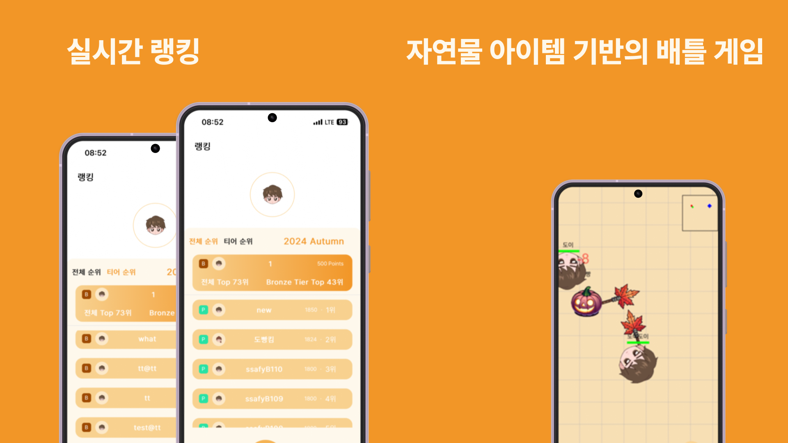

- 각 시즌별 시즌제 게임 및 랭킹
  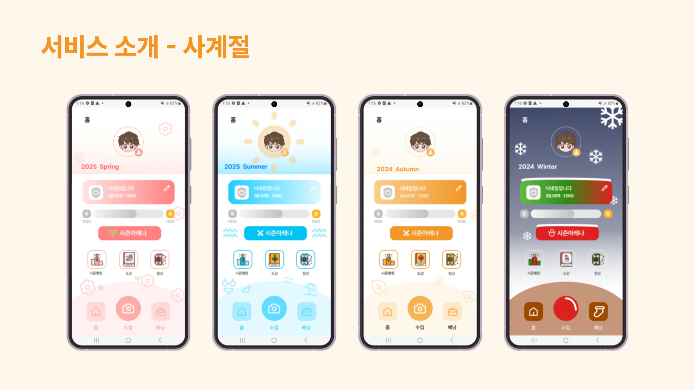

### UI/UX 및 서버 최적화

- **비트마스킹 및 기하 알고리즘을 통한 게임 서버 로직 최적화**: 다수의 게임 방을 효율적으로 관리하여 빠른 응답성과 원활한 플레이 경험 제공.
- **Redis 기반의 빠른 서버 간 통신**: 게임 플레이 중 데이터 전송 속도를 향상시켜 실시간 상호작용을 지원.
- **랭킹 데이터 관리**: 메시지 브로커를 활용하여 랭킹 데이터의 유실을 방지하고, Redis를 통해 응답 속도를 10배 이상 향상시키며, 주기적인 데이터베이스 동기화를 통해 데이터 일관성 유지.
- **서버와 클라이언트 로직 분리**: 서버와 클라이언트의 역할을 명확히 하여 각자의 책임을 분산시키고, 코드의 유지보수성과 확장성을 향상.
- **치팅 방지 시스템**: 아이템 수집 단계에서 클라이언트의 부정한 수집을 방지하기 위해 서버 측에서 수집 요청을 검증하고, 아이템 수집 조건을 철저히 관리하여 공정한 게임 환경을 유지.
- **MSA 설계**: 서버의 수평적 확장성을 고려하여 모듈화된 아키텍처를 구현, 필요에 따라 서버 리소스를 유연하게 조정할 수 있도록 지원.
- **클라이언트 렌더링 최적화**: useCallback 과 React.memo를 활용해 불필요한 렌더링 방지, state변화, 카테고리 변경시 중복으로 렌더링 되는 현상 방지
- **클라이언트의 불필요한 재계산 방지**: 서버에서 전체 아이템 배열로 받아오는 정보를 useMemo를 활용하여 아이템 인벤토리의 페이징처리 및 아이템 종류 필터링 로직을 최적화 하여 불필요한 배열 연산을 줄임. 유저에게 보여지는 부분만 계산 하도록 함
- **Real time 업데이트 무한 스크롤**: real time으로 업데이트 되는 실시간 랭킹을 게임 후 바로 확인 가능
- **컴포넌트 재사용 극대화 함에 따른 상태관리 redux 라이브러리 활용**: 수집, 합성, 유저정보, 인벤토리, 게임 아이템, 게임 매칭, 게임 결과 반영을 위한 상태관리 라이브러리를 사용하여, 서버에 요청없이도 모든 컴포넌트에서 클라이언트의 데이터 정합성 보장
  - 예) 유저의 게임 매칭을 위한 상태관리, 수집성공 아이템을 일정 시간이 경과해야 재수집 할 수 있도록 수집 상태 관리

## 차별점

- **오프라인 경험과 연계된 게임 플레이**
  - 단순히 온라인에서만 이루어지는 게임이 아니라, 실제 야외에서 자연물을 탐지하고 수집하는 오프라인 경험을 게임과 연계한 점이 차별화 요소입니다. 사용자는 게임 속 가상 세계뿐만 아니라 현실 세계에서의 활동을 통해 게임의 진척도를 높일 수 있어, 기존의 순수 온라인 게임과 차별화됩니다.
- **과금 요소 없는 게임 서비스**
  - 대부분의 모바일 게임이 아이템 구매나 승리 확률을 높이기 위한 과금 요소를 포함하고 있는 것과 달리, 이 게임은 **과금이 전혀 없는** 구조로 설계되었습니다. 모든 플레이어가 동일한 조건에서 게임을 즐길 수 있으며, 과금 유도 없이도 완성도 높은 게임 경험을 제공함으로써 공정성과 사용자의 몰입을 극대화합니다.
- **계절에 대한 학습 효과**
  - 게임을 통해 사계절의 자연물을 탐지하고 수집하면서, **계절에 따른 자연의 변화를 체험적으로 학습**할 수 있습니다. 이를 통해 아이들은 자연스럽게 각 계절의 특성, 제철 특산물, 생태계를 이해하게 되고, 단순한 오락을 넘어 교육적 가치를 제공합니다. 계절과 관련된 다양한 퀘스트와 도감 시스템을 통해 학습 동기를 부여하며, 자연감수성을 키울 수 있습니다.

## 기대효과

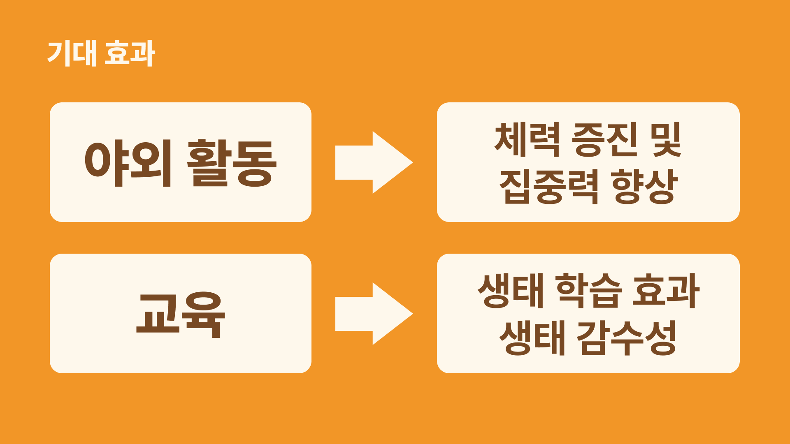

- **아이들의 야외활동 촉진과 건강 증진**
  - 게임 내 자연물 탐지 기능을 통해 아이들은 모바일 기기를 사용하면서도 야외활동을 경험할 수 있습니다. 이를 통해 자연을 배우고 체험하는 동시에, 신체 활동량을 늘려 과체중 및 비만 문제를 해결하는 데 기여할 수 있습니다.
- **생태 감수성 및 자연 학습 효과**
  - 사계절에 따른 다양한 자연물을 수집하고 이를 게임 도감에 기록하는 과정에서, 아이들은 자연의 변화와 계절감을 익히고 생태 감수성을 키울 수 있습니다. 게임을 통해 학습적인 효과를 극대화할 수 있는 교육적인 기능도 포함됩니다.
- **스마트폰 이용의 긍정적 전환**
  - 스마트폰 이용이 불가피한 현대 사회에서, 아이들이 단순한 오락 이상의 가치를 제공하는 게임을 통해 시간을 보낼 수 있습니다. 자연을 배우고 활동하는 과정이 게임에 녹아들어, 스마트폰 사용의 부정적 영향을 줄이면서도 긍정적인 경험을 제공합니다.
- **빅데이터 분석을 통한 개인화된 경험 제공**
  - ELK 파이프라인을 통해 수집된 빅데이터를 기반으로, 매칭 시간 예측과 같은 개인화된 게임 경험을 제공할 수 있습니다. 이를 통해 사용자들은 더욱 매끄러운 게임 경험을 즐길 수 있으며, 서비스의 만족도가 향상될 것으로 기대됩니다.

## ERD

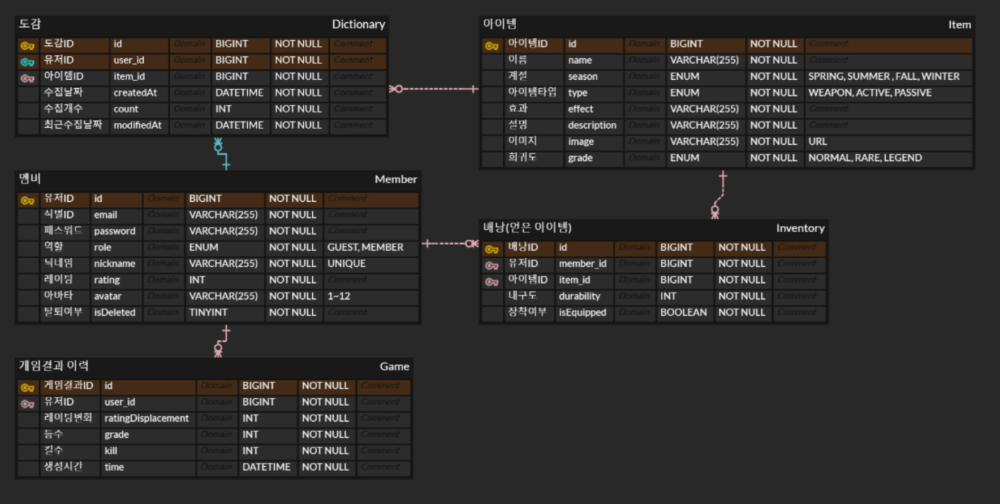

## 아키텍쳐 설계

### 전체 아키텍쳐

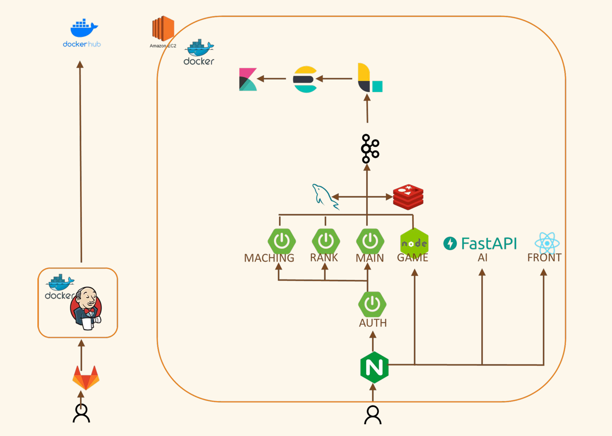

### 게임 아키텍쳐

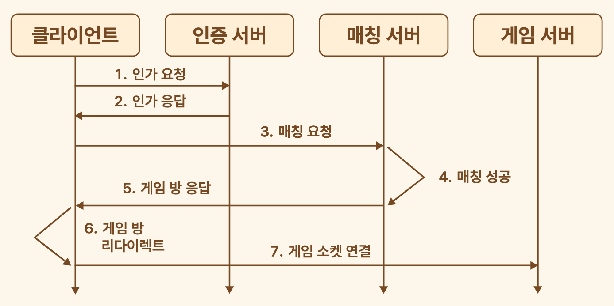

### 랭킹 아키텍쳐

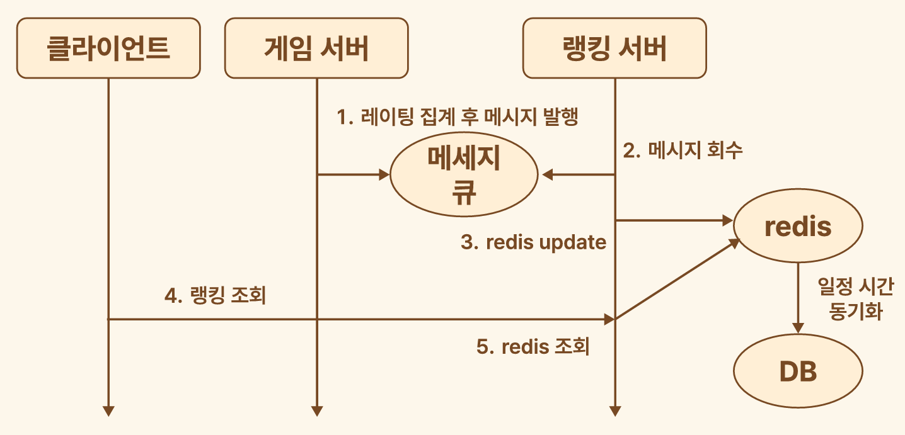

## 패키지 구조

### 프론트엔드

- FSD 아키텍쳐 도입: 각 레이어에 비즈니스 지향적인 고유 책임 영역 부여하여 계층적으로 설계
- 아토믹 디자인패턴 도입

```
src/
 app/                        # 애플리케이션 로직이 초기화되는 곳으로 프로바이더, 라우터, 전역 스타일, 전역 타입 선언
 ├── redux                   # Redux store 및 미들웨어 설정
 │   ├── store               
 │   └── slices              # 전역적으로 사용되는 상태 slice
 ├── apis                    # API 호출과 통식 로직 분리
 ├── hooks                   # 커스텀훅
 ├── types                   # 공통 타입 정의
 └── app-router      
 assets/
 ├── icons/                  # 아이콘 파일들
 ├── images/                 
 └── symbols/               
 features/                   # 사용자의 비즈니스 시나리오와 기능 단위의 컴포넌트(atomic design의 templetes단위)
 ├── auth/                   # 인증 관련 기능
 │   ├── auth-slice.ts       # Redux slice
 │   ├── types.ts            # 인증 관련 타입
 │   └── services.ts         # API 호출 등 서비스 로직
 └── inventory/              # 아이템 인벤토리 관련 기능
 │   ├── profile-slice.ts    # Redux slice
 │   ├── types.ts            # 프로필 관련 타입
 │   └── services.ts         # API 호출 등 서비스 로직
 └── index.ts                # 공개 API
 pages/                      # 애플리케이션의 페이지가 포함되는 레이어atomic design의 page 단위
 ├── LoginPage.tsx           # 로그인 페이지
 ├── MainPage.tsx            # 메인 페이지
 └── index.ts                # 공개 API
 shared/                     # 특정 비즈니스 로직에 종속되지 않은 재사용 가능한 컴포넌트와 유틸리티
 ├── components/             # 공통적으로 사용되는 컴포넌트
 │   ├── atoms               # atomic design의 atom에 해당
 │   │   ├── buttons
 │   │   ├── symbols
 │   │   │   └── tier
 │   │   └── index.ts        # 공개 API
 │   ├── entities            # 비즈니스 엔티티로서 atomic design의 melecules, organism 단위
 │   │   ├── inventory
 │   │   ├── result
 │   │   ├── user-info
 │   │   └── index.ts        # 공개 API
 │   └── index.ts            # 공개 API
 ├── widget/                 # 페이지에 사용되는 독립적인 UI 컴포넌트입니다.
 │   ├── ui                  # 각 layout 구성요소 단위
 │   └── index.ts            # 공개 API
 └──  utils/                 # 유틸리티 함수 모음
     ├── fetch-user-info.ts
     └── format.ts
config.ts
custom-sw.ts
```

### 백엔드

- 헥사고날 아키텍처 도입: 비즈니스 로직과 외부 요소를 분리하여 유연성과 확장성 향상

```
└─auth
    ├─domains
    │  ├─conbination
    │  │  └─adapter
    │  │      ├─in
    │  │      └─out
    │  ├─dictionary
    │  │  └─adapter
    │  │      ├─in
    │  │      └─out
    │  ├─endGame
    │  │  └─adapter
    │  │      ├─in
    │  │      └─out
    │  ├─inventory
    │  │  └─adapter
    │  │      ├─in
    │  │      └─out
    │  ├─member
    │  │  ├─adapter
    │  │  │  ├─in
    │  │  │  │  └─web
    │  │  │  │      ├─controller
    │  │  │  │      ├─message
    │  │  │  │      └─requestdto
    │  │  │  └─out
    │  │  │      └─persistence
    │  │  │          └─client
    │  │  ├─application
    │  │  │  ├─port
    │  │  │  │  ├─in
    │  │  │  │  └─out
    │  │  │  └─service
    │  │  └─domain
    │  └─rank
    │      ├─adapter
    │      │  ├─in
    │      │  └─out
    │      │      ├─client
    │      │      └─kafka
    │      └─application
    │          └─port
    │              └─out
    └─global
        ├─config
        ├─entity
        ├─exception
        ├─kafka
        │  ├─config
        │  └─producer
        ├─security
        │  ├─auth
        │  │  └─repository
        │  ├─exceptionHandler
        │  ├─jwt
        │  └─oauth
        └─util
```

## 프로젝트 실행 화면

### 로그인

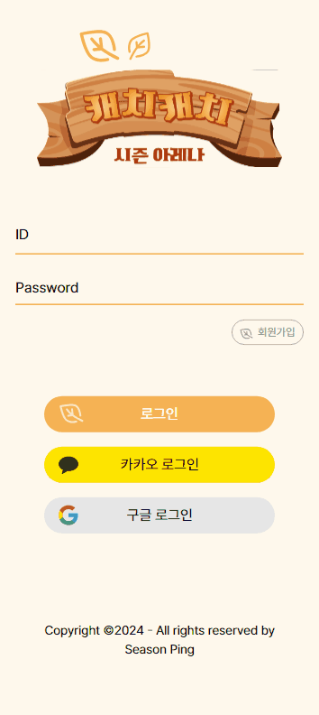

### 아바타 변경

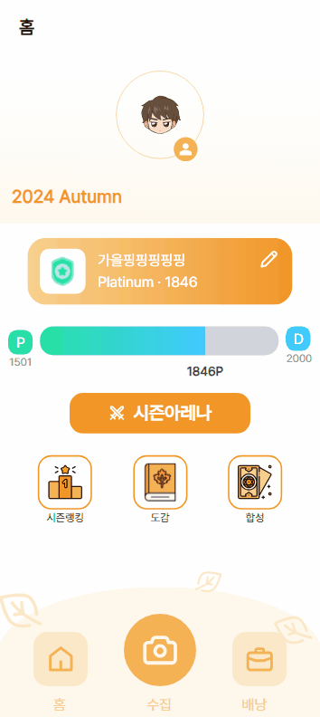

### 닉네임 변경


### 랭킹


### 도감


### 인벤토리

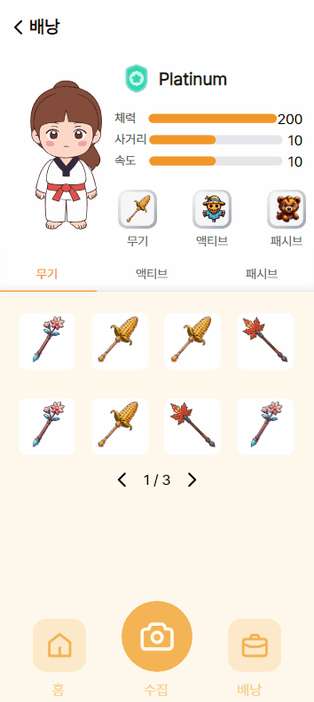

### 아이템 합성

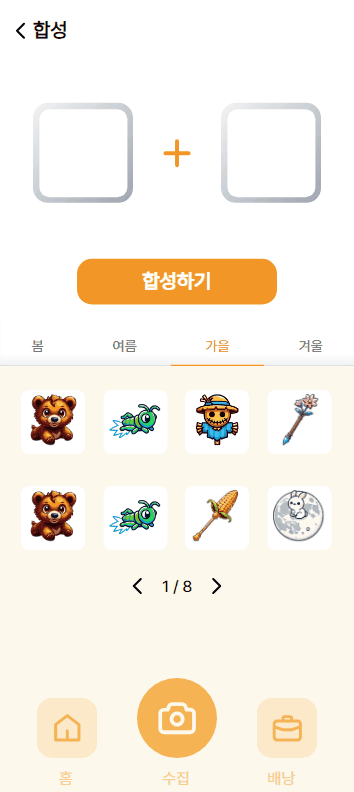

### 매칭

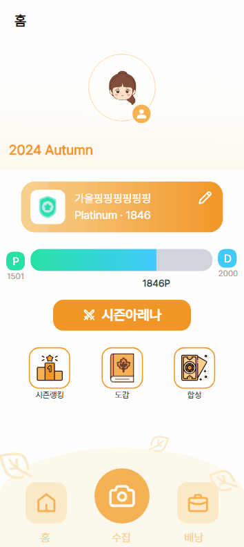
